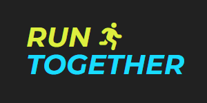
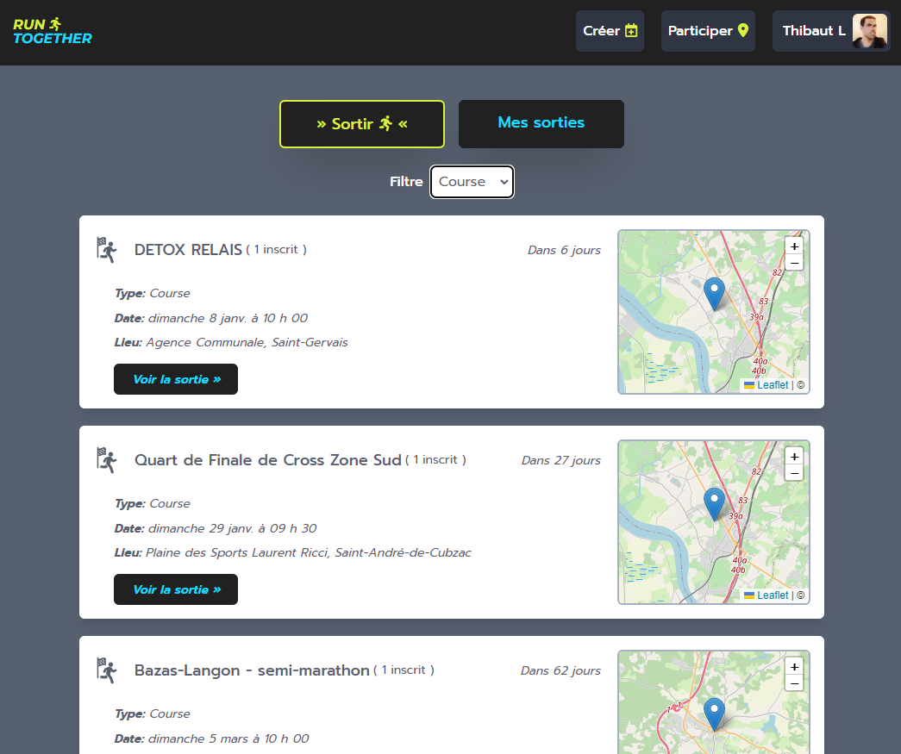

# Runtogether.fr - Planifiez vos activités sportives

[runtogether.fr](https://runtogether.fr)
Projet créé avec [Create React App](https://github.com/facebook/create-react-app).

## Built with

Ce projet a été réalisé en utilisant les technologies suivantes :

### Front-end

- [React18](https://reactjs.org/)
- [React Router](https://reactrouter.com/en/main) / [React Hook Form](https://react-hook-form.com/)
- [React Leaflet](https://react-leaflet.js.org/) (provider: OpenStreeMap)
- [Sass](https://sass-lang.com/)
- [Tailwind CSS](https://tailwindcss.com/)

### Back-end

- [NodeJS](https://nodejs.org/en/)
- [Express](https://expressjs.com/)
- [MongoDB](https://www.mongodb.com/)
- [Mongoose](https://mongoosejs.com/)
- autres librairie: bcrypt, cookie-parser, express-rate-limit, jsonwebtoken, multer, nodemailer, etc...

### Web-server

Le front et le backend tourne sur un VPS (ubuntu 22.04), le tout entièrement gérer via protocole SSH

## Concernant le projet

Ce projet a été créé uniquement dans le but de renforcer mes compétences de développeur full-stack, runtogether.fr n'a aucun but lucratif et ne sera probablement plus mis à jour.

Créer runtogether.fr a été un réel challenge, le fait de devoir gérer l'entièreté du projet m'a permis de mieux comprendre le fonctionnement d'un projet dans sa globalité. J'ai également appris à gérer un serveur web, je n'avais aucune connaissance dans le domaine (VPS, SSH, certificat SSL, etc...).

Concernant le code, le front-end reste publique, Notez cependant que malgré l'utilisation de variables d'environnement et pour des raisons de sécurité, je ne partagerais le back-end que sur demande (recruteurs uniquement).

## Fonctionnalités

- Créer un compte
- Se connecter / déconnecter (login géré par JsonWebToken)
- Changer ses paramètres utilisateur (avatar, infos personnelles)
- Réinitialiser sont mot de passe
- Envoyer un message au support (nodemailer)
- Créer une activité avec point de RDV sur la carte (Leaflet)
- Modifier / supprimer une activité
- Commenter une activité, signaler / supprimer un commentaire.
- Voir / filtrer les activités existantes.
- Rate Limiter pour éviter certains abus (création de comptes, contact du support, etc...)

## Screenshot

À compléter...

## Auteur

- LinkedIn [Thibaut Lefevre](https://www.linkedin.com/in/thibaut-lefevre-b60101117/)
- Frontend Mentor [@malboyoo](https://www.frontendmentor.io/profile/malboyoo)